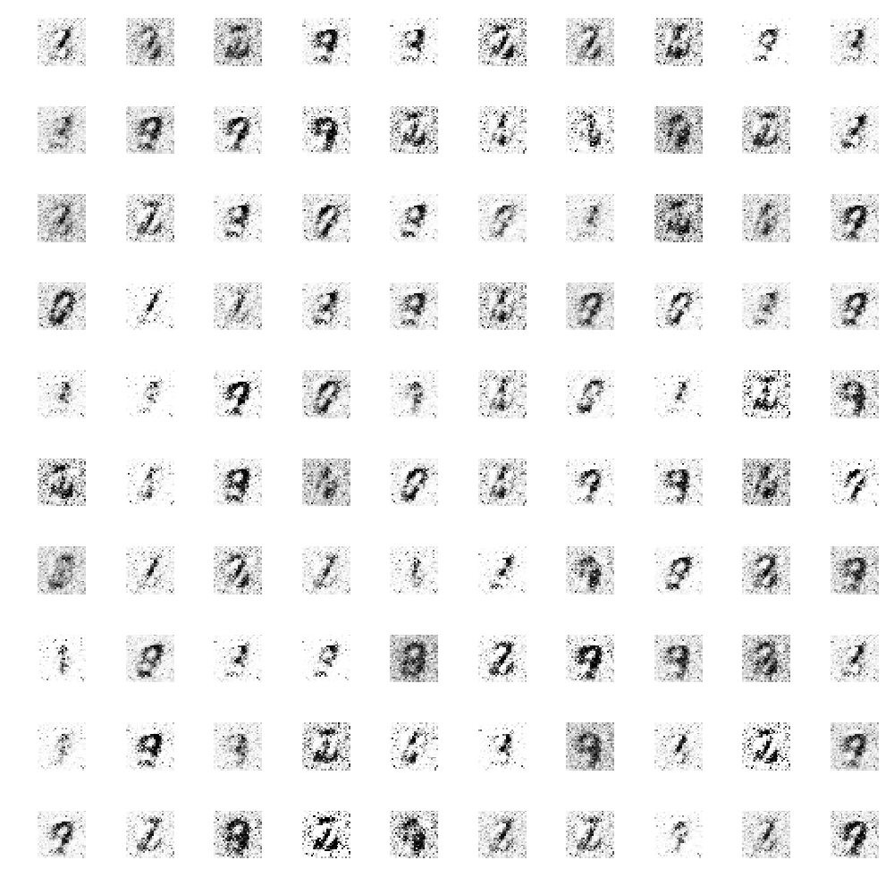
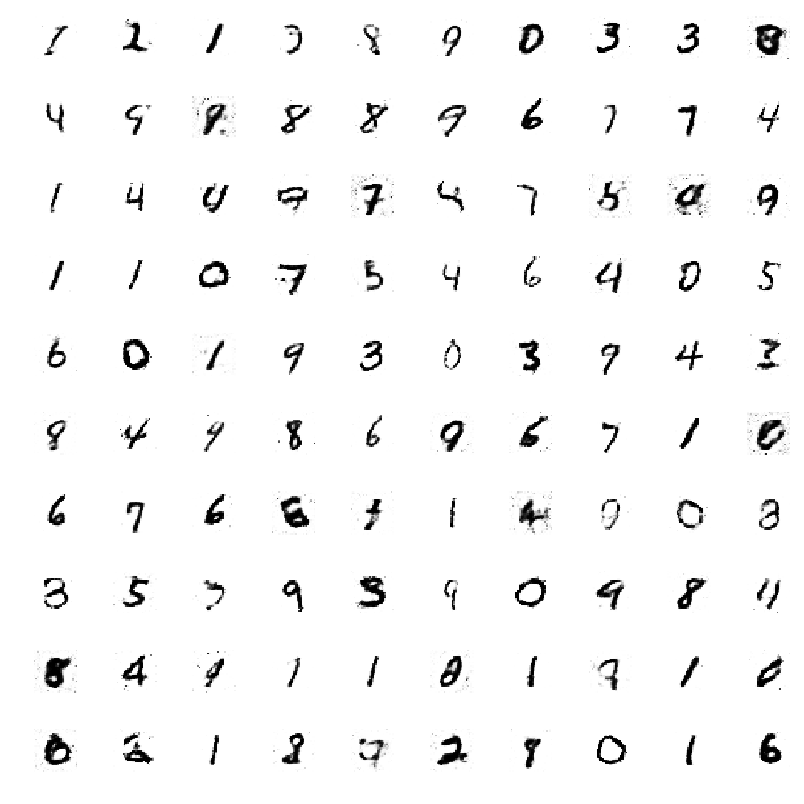
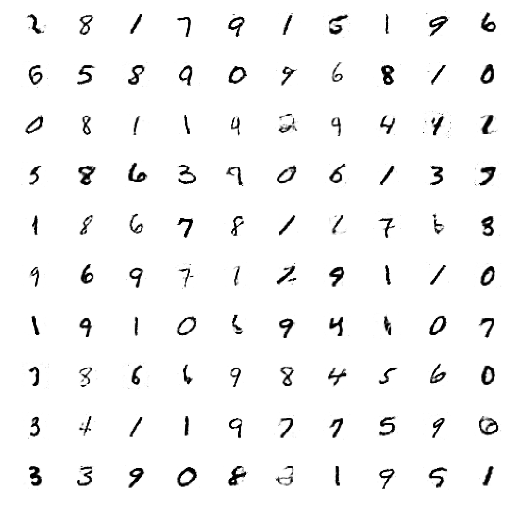

 
 

# Generative Adversarial Networks
Neural Networks are universal function approximators. 
This means given large amount of data and ample number of neurons they can approximate a given function. 
What if we make two networks play along? One to fool other and other to not get fooled!

The two networks are - Generator and Discriminator

Consider being a fake currency producer. You continuously try to outsmart the currency checker. 
While the currency checker continuously tries to get better at differentiating between the fake and the true currency.
That is what GAN is all about.

## Generator
A Generator tries to generate data as similar to real data as possible, given some random noise. 
This means it tries to map a function:

## Discriminator
The Discriminator tries to discriminate between fake and real data. It learns to get better at it while generator gets better at generating new real like data. 
So, the discriminator tries to approximate a function:

## Results

* Epoch 0

* Epoch 100

* Epoch 480

## Demo
Run Command `python generate.py` to see 100 generated examples.
